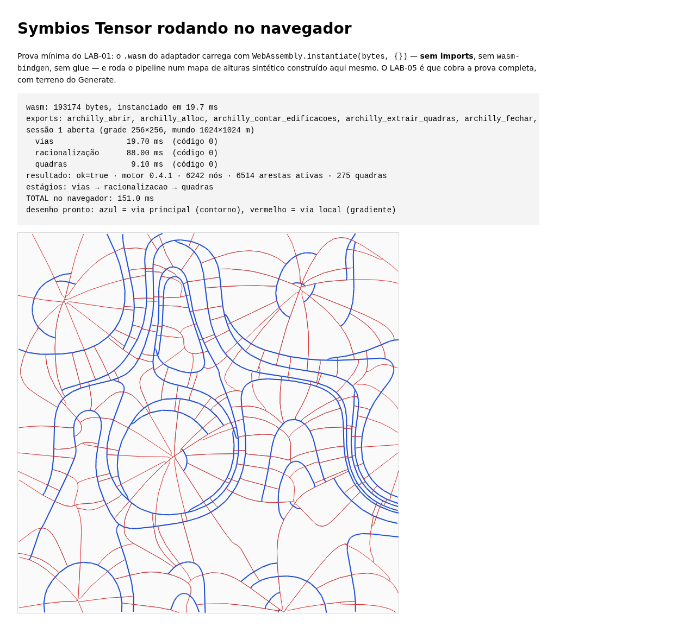

# LAB-01 — ADAPTADOR MÍNIMO DO SYMBIOS TENSOR

**Data:** 10/09/2026 · **Etapa:** C da especificação (Adapter mínimo), escopo
Uso B (rede viária) + Uso C (quadras)

## Veredito

> ### Geometria utilizável: **SIM COM RESSALVAS**

A cadeia fecha de ponta a ponta. Um terreno do Archilly Geo entra pelo contrato
`archilly-terreno`, vira mapa de alturas, atravessa os três estágios do Symbios
dentro de um `.wasm` de 189 KB sem import nenhum, e volta como polilinhas de eixo
com hierarquia e rampa, mais polígonos de quadra com área — em metros, no plano
local do Generate, georreferenciado, determinístico por seed, e em tempo
compatível com uso interativo até 200 ha.

**As ressalvas, em ordem de gravidade:**

1. **A rampa pedida não é respeitada nos cruzamentos.** Ao longo de uma via o
   clamp do motor fecha sem exceção (pior caso medido: 10,04 % contra 10 %
   pedidos). Em nó de grau 3 ou mais aparecem 49 %, 69 %, 365 %. Não é falta de
   convergência — é estrutural. **A conferência de rampa é do Validator, e é no
   cruzamento que ele vai reprovar.** (§5, D10)
2. **Cerca de 38 % do comprimento de via nasce fora da gleba.** Esperado — o
   motor gera sobre um retângulo e a gleba não é retângulo —, mas significa que
   o LAB-02 vai descartar mais de um terço do que o motor produz, e que a rede
   que sobra pode chegar desconectada na divisa. (§6)
3. **A rede é topograficamente responsiva e urbanisticamente crua.** Vias
   principais fecham anéis em torno dos morros e locais descem em leque a partir
   dos cumes — dezenas convergindo num ponto. É o comportamento anunciado do
   campo tensorial, e não é um traçado que se aprova. (§8)
4. **Terreno abaixo de ~2 ha não produz rede.** Limitação de escala, não do
   motor: com quadra de 80 m, uma gleba de 450 m² não comporta duas quadras. (§4)
5. **O gargalo hoje é o adaptador, não o motor.** A interpolação do relevo custa
   4 885 ms num terreno de 200 ha contra 631 ms do estágio caro do Symbios. É
   código do Lab e é otimizável; nada foi otimizado, conforme a regra. (§7)

Nenhuma ressalva é impeditiva para o LAB-02. A 1 é justamente o que o Validator
existe para pegar; a 2 é o trabalho do LAB-02; a 3 é o que o Judge do LAB-03 tem
de pesar.

---

## 1. O que foi construído

```text
terreno do Archilly Geo  (archilly-terreno 1.x, GeoJSON em WGS84)
        │  src/terreno-geo.ts        lê o contrato, projeta para metros locais
        ▼
   plano local (metros, x leste / y sul — a convenção do Generate)
        │  src/alturas.ts            curvas de nível → grade regular
        ▼
   mapa de alturas  +  máscara do que caiu fora da gleba
        │  src/parametros.ts         urbanismo → vocabulário do motor
        ▼
   .wasm (189 KB, zero imports)
        │  archilly_gerar_vias        ─┐
        │  archilly_racionalizar        ├─ symbios-tensor 0.4.1
        │  archilly_extrair_quadras   ─┘
        ▼
   grafo viário + faces, no mundo do motor
        │  src/index.ts               encadeia arestas em vias, mede rampa
        ▼
   vias (hierarquia, rampa, comprimento) + quadras (área, perímetro)
        │  src/geojson.ts             volta para graus
        ▼
   GeoJSON WGS84 + diagnóstico com hash
```

Uma função pública: `gerarRedeViaria(motor, terreno, parametros, seed)`.

### Parâmetros, em unidades do urbanismo

| Parâmetro | Padrão | De onde veio o padrão |
|---|---|---|
| `espacamentoPrincipal_m` | 200 | LAB-00: deu quadras de 3 439 m² medianos |
| `espacamentoLocal_m` | 80 | idem — e 37× mais rápido que os defaults do upstream |
| `rampaMaxima_pct` | 10 % | `LIMITES_TOPOGRAFIA.rampaMaxPct` do Generate |
| `faixaDominio_m` | 8,4 | `NORMA_BR.via.caixaMinima` do Generate (6 + 2 × 1,2) |
| `passoGrade_m` | 2 | ver §7 |
| `extrairQuadras` | `true` | Uso C ligado |

**Os defaults do upstream — via a cada 15 m — não aparecem em lugar nenhum da
interface.** Os nomes do Symbios existem num arquivo só, `src/parametros.ts`.
(D13)

### O contrato de entrada

O prompt nomeia o `archilly.geo.2`. Investigado, **ele não serve**: é o pacote
para o Archilly Studio 2D/3D, e leva estado de aplicativo (vistas salvas, camadas
visíveis, basemap, `terrenos` como blob opaco). O contrato certo para alimentar
um motor de loteamento é o **`archilly-terreno`**, hoje na 1.1, que é GeoJSON com
poligonal oficial, APP e restrições já recortadas ao terreno, curvas de nível com
cota, e zoneamento. É o que o Generate consome. (D02)

**Arquivos que definem os contratos**, para quem for verificar:

| O quê | Onde |
|---|---|
| `archilly-terreno` 1.1 — definição normativa | Geo · `src/lib/contratos/archilly-terreno.ts` |
| Montagem do arquivo a partir do estudo | Geo · `src/lib/contratos/montar.ts` |
| Restrições no contrato | Geo · `src/lib/geo/restricoes/contrato.ts` |
| `archilly.geo.2` — pacote do Studio | Geo · `src/lib/geo/contrato.ts` |
| Ponte de consumo no Generate | Generate · `src/lib/import/archilly-terreno-import.ts` |
| Projeção local (plano tangente, y-sul) | Generate · `src/lib/import/geo-projecao.ts` |
| Hierarquia viária (`TrechoViario.tipo`) | Generate · `src/lib/engine/gerar-v1.ts:257` |
| Rampa máxima e declividade | Generate · `src/lib/engine/topografia.ts` |
| Caixa mínima de via | Generate · `src/lib/normas/br.ts` |

Nada foi alterado nos dois repositórios; foram clonados só para leitura.

---

## 2. Os terrenos de prova

**Os estudos de prova do Geo não têm geometria.** `estudos-de-prova.ts` é entrada
de dossiê e prancha — área, perímetro, contagem de vértices, restrições e relevo
resumido, mas `vertices: []` e testadas com coordenadas de exemplo. Ele existe
para comparar formatação, linha a linha, e o comentário no topo diz isso.

Os terrenos em `docs/terrenos/` usam os **números reais** dos estudos e
**geometria construída** para casar com eles. Cada arquivo declara isso no bloco
`archilly.procedencia`. (D04)

| Terreno | Área | Vértices | Desnível | Curvas | Restrições | Procedência |
|---|---|---|---|---|---|---|
| `pequeno` | 450 m² | 4 | 0,5 m | 27 | — | números do estudo `pequeno` |
| `completo` | 141,76 ha | 20 | 114,55 m | 1 060 | 3 | números do estudo `completo` |
| `sintetico-10ha-plano` | 10 ha | 10 | 8 m | 204 | — | **sintético**, declarado |
| `sintetico-50ha-ondulado` | 50 ha | 14 | 45 m | 575 | — | **sintético**, declarado |

As curvas de nível são isolinhas de verdade, extraídas de uma superfície
analítica por *marching squares* — não polilinhas decorativas. Isso importa
porque o adaptador reinterpola as curvas de volta numa grade, e só com isolinhas
verdadeiras a comparação entre rampa e declividade quer dizer algo.

---

## 3. Tempo por estágio

Node v22.22.2, linux-x64, `.wasm` de 193 174 bytes. Milissegundos de parede.

| Terreno | alturas | vias | racionalização | quadras | volta | **TOTAL** |
|---|---|---|---|---|---|---|
| `pequeno` (0,045 ha) | 12,5 | 0,33 | 0,29 | 0,12 | 0,17 | **15,3** |
| `sintetico-10ha-plano` | 505,5 | 1,22 | 0,78 | 0,12 | 0,71 | **508,9** |
| `sintetico-50ha-ondulado` | 715,9 | 8,29 | 39,1 | 6,10 | 17,1 | **791,7** |
| `completo` (141,76 ha) | 3 271,5 | 31,3 | 384,3 | 22,4 | 113,0 | **3 844,4** |

**O estágio de alturas domina em todos os casos, e ele é do adaptador.** Os três
estágios do motor somados dão 438 ms no terreno de 141 ha, contra 3 271 ms da
interpolação. Ver §7.

---

## 4. Vias e quadras

| Terreno | vias | principais | locais | comprimento | mediana | quadras | área mediana | área máx |
|---|---|---|---|---|---|---|---|---|
| `pequeno` | **0** | 0 | 0 | 0 m | — | **0** | — | — |
| `10 ha plano` | 15 | 5 | 10 | 4 274 m | 332 m | 12 | 1 637 m² | 16 175 m² |
| `50 ha ondulado` | 157 | 30 | 127 | 28 837 m | 129 m | 167 | 1 902 m² | 43 420 m² |
| `completo` | 502 | 105 | 397 | 88 495 m | 110 m | 653 | 1 818 m² | 34 095 m² |

**As quadras têm tamanho plausível de loteamento** — mediana entre 1 600 e
1 900 m², com caudas de 200 m² a 43 000 m². É a diferença que a calibração do
LAB-00 faz: com os defaults do upstream, a mediana era 97 m².

**O `pequeno` não produz rede, e isso está certo.** Uma gleba de 450 m² tem
~21 m de lado equivalente; com via local a cada 80 m não cabem duas quadras. O
adaptador avisa antes de rodar, nomeando a causa como limitação de escala. É
teste de sanidade — o prompt já o classificava assim.

**A hierarquia se inverte com o relevo.** No terreno plano, 5 principais para 10
locais; no ondulado, 30 para 127. Faz sentido: principal segue curva de nível e
local desce o gradiente — quanto mais relevo, mais gradiente a descer.

---

## 5. Rampa — a ressalva principal

### 5.1 O que se mede

| Terreno | mediana | p90 | máxima | trechos acima de 10 % (de) |
|---|---|---|---|---|
| `10 ha plano` | 10,01 % | 10,02 % | **10,04 %** | **0** de 15 |
| `50 ha ondulado` | 10,02 % | 15,64 % | 69,93 % | 48 de 157 |
| `completo` | 15,92 % | 42,95 % | 365,28 % | 338 de 502 |

A mediana pousada em 10,0 % é a **assinatura do clamp funcionando**: um limitador
de rampa transforma barranco em rampa longa no máximo permitido, então a
distribuição se acumula exatamente sobre o limite. No terreno plano ele fecha
perfeitamente — zero violações.

### 5.2 Onde estão as violações

`ferramentas/diagnostico-rampa.ts` mede aresta por aresta na saída **crua** do
motor, sem passar pelo encadeamento do adaptador, e separa por grau do nó.
Terreno de 50 ha, dentro da gleba, com racionalização ativa:

| grau do nó | arestas | acima do pedido | rampa média | **rampa máxima** |
|---|---|---|---|---|
| 1 — ponta | 4 | 0 | 6,80 % | 10,00 % |
| **2 — ao longo da via** | **2 804** | **0** | 7,16 % | **10,04 %** |
| 3 — cruzamento em T | 194 | 7 | 4,10 % | **69,93 %** |
| ≥ 4 — cruzamento | 354 | 38 | 4,90 % | 49,70 % |

**Ao longo de uma cadeia o clamp fecha sem uma única exceção. Todas as violações
estão em cruzamento.**

Três hipóteses foram testadas; duas caíram:

- **não é o encadeamento do adaptador** inventando vizinhança — a medição é sobre
  arestas cruas do motor;
- **não é relevo extrapolado fora da gleba** — dentro da gleba o padrão é o mesmo;
- **não é falta de convergência** — 10 passes contra 1 000, tolerância `1e-2`
  contra `0`, dão resultado idêntico (1 104 contra 1 103 arestas acima).

A leitura é que o clamp opera por cadeia, e um nó compartilhado por várias
cadeias não pode ser movido sem quebrar as outras.

### 5.3 O que acontece ao pedir rampas diferentes

Terreno de 50 ha:

| rampa pedida | máxima obtida | trechos acima |
|---|---|---|
| 6 % | 116,67 % | 111 de 157 |
| 8 % | 82,53 % | 76 de 157 |
| 10 % | 69,93 % | 48 de 157 |
| 15 % | 58,59 % | 15 de 157 |

O parâmetro **tem efeito** — pedir menos produz mais violação porque o clamp
empurra mais desnível para os nós que ele não controla. Pedir 15 % em vez de 10 %
reduz as violações de 48 para 15. Não é solução: é o retrato de um limitador que
não fecha o circuito.

### 5.4 Recomendação

**Não corrigir no Adapter.** Corrigir cota de cruzamento é redesenhar o perfil da
via — decisão de projeto, não de tradução. Se o Adapter começar a consertar
geometria, o Judge do LAB-03 vai comparar o conserto do Adapter com o motor
Geométrico, não o Symbios.

**Para o LAB-02:** a checagem de rampa do Validator tem de olhar o **cruzamento**,
e é ali que ela vai reprovar. Um pós-processamento de cotas de nó (relaxação que
respeite todas as cadeias incidentes) é o caminho óbvio, e é trabalho de motor,
não de ponte.

### 5.5 Conferência contra a declividade do terreno

O prompt pede que a rampa devolvida seja coerente com a declividade que o Geo já
mediu no mesmo lugar. Medindo o **corte e aterro** — de quanto o nó da via está
acima ou abaixo do terreno:

| Terreno | declividade da superfície (p90) | corte/aterro mediano | p90 | máximo |
|---|---|---|---|---|
| `10 ha plano` | 0 % | 0,00 m | 0,37 m | 0,66 m |
| `50 ha ondulado` | 36,1 % | 0,11 m | 0,92 m | 3,21 m |
| `completo` | 50,7 % | 0,09 m | 0,25 m | 2,92 m |

A divergência é **esperada e é o ponto**: o motor terraplena de propósito — corta
morro e aterra baixada para manter a rampa. Se as duas cotas batessem, o clamp
não estaria fazendo nada. A ordem de grandeza é plausível: menos de um metro na
mediana, poucos metros no pior caso, num terreno com 36 % a 51 % de declividade
no percentil 90. **Não há corte de dezenas de metros**, que seria o sinal de que
o motor está desenhando uma via impossível.

---

## 6. Fora da gleba — o que o LAB-02 vai recortar

| Terreno | grade fora | **comprimento de via fora** | área de quadra fora |
|---|---|---|---|
| `10 ha plano` | 48,5 % | 38,6 % | 41,6 % |
| `50 ha ondulado` | 42,6 % | 38,0 % | 23,2 % |
| `completo` | 42,8 % | 37,6 % | 32,6 % |

O motor gera sobre a caixa envolvente da gleba mais uma folga; a gleba é
irregular. **Mais de um terço do comprimento de via nasce fora e vai ser
descartado.**

Duas consequências para o LAB-02:

1. **O recorte não é cosmético.** Descartar 38 % da rede pode deixar trechos
   isolados dentro da gleba — via que entrava pela borda e cujo acesso ficou do
   lado de fora. O recorte tem de ser seguido de uma verificação de conectividade.
2. **Vale considerar recortar antes, não depois.** Rebaixar o relevo fora da
   gleba abaixo do `water_level` faria o motor evitar aquela área por conta
   própria — o mecanismo que o LAB-00 já havia identificado. Não foi feito aqui
   porque o prompt reserva o recorte ao LAB-02, e porque criar um penhasco na
   divisa tem efeito colateral no campo tensorial (D12).

**Nota:** este número foi medido errado na primeira versão. A métrica somava o
comprimento **inteiro** de todo trecho que tivesse um só ponto fora, e relatava
"100 % das vias fora da gleba" num terreno onde a rede estava quase toda dentro.
Agora é por amostragem ao longo de cada segmento.

---

## 7. Escala — onde o O(N²) começa a doer

Mesma forma de gleba, mesmo desnível (45 m), só a área muda:

| Área | grade | vias | quadras | área mediana | alturas | vias | **racionalização** | volta | TOTAL |
|---|---|---|---|---|---|---|---|---|---|
| 10 ha | 241×201 | 26 | 17 | 971 m² | 148 ms | 1,4 | **2,5 ms** | 1,2 | **155 ms** |
| 50 ha | 512×425 | 149 | 165 | 2 028 m² | 572 ms | 8,9 | **40,7 ms** | 13,0 | **646 ms** |
| 100 ha | 716×592 | 330 | 419 | 1 551 m² | 1 492 ms | 17,0 | **155,4 ms** | 45,5 | **1 731 ms** |
| 200 ha | 1004×829 | 680 | 948 | 1 702 m² | 4 885 ms | 36,0 | **631,4 ms** | 83,4 | **5 676 ms** |

### O O(N²) do motor não é o problema que o LAB-00 temia

De 10 para 200 ha — vinte vezes a área — a racionalização vai de 2,5 ms a
**631 ms**. Continua sendo superlinear, como o LAB-00 mediu, mas em terreno real
com espaçamento de loteamento **não dói**: 631 ms numa gleba de 200 ha é
perfeitamente utilizável.

O LAB-00 tinha registrado 128 segundos num mundo de 4 km². A diferença é a
calibração: aquele número foi medido com os defaults do upstream, que põem uma
via a cada 15 m. Com 200/80 m a contagem de nós é uma ordem de grandeza menor, e
o custo quadrático incide sobre um número muito menor.

**Recomendação: nenhum contorno é necessário até 200 ha.** Processar por setores
resolveria o custo e criaria costura entre setores — o mesmo problema que o
`CityStreamer` do upstream tem e admite ("tile boundaries currently produce
visible seams"). Não vale trocar um custo que não incomoda por uma emenda visível.

### O gargalo real é o adaptador

A interpolação do relevo custa **4 885 ms** contra 631 ms do motor no terreno de
200 ha — quase oito vezes. É código do Lab, não do Symbios.

Duas coisas o explicam, e uma é artificial: os terrenos de prova têm curvas de
nível **muito** mais densas que um levantamento real, porque foram extraídas por
*marching squares* de uma superfície analítica (1 060 polilinhas no terreno de
141 ha). Um terreno do Geo tem ordens de grandeza menos vértices.

Nada foi otimizado, conforme a regra do laboratório. Se um dia precisar, os
caminhos óbvios são: reduzir a densidade de vértices das curvas na leitura,
e calcular a grade só onde ela é usada.

**Sobre `passoGrade_m`:** fixado em 2 m. O LAB-00 mediu que o custo do motor
depende da extensão do mundo, não da resolução da grade — mundo fixo de 512 m
com grades de 128², 256² e 512² deu todos ~245 ms. Refinar não ajuda o motor e
custa no estágio de alturas, que é quadrático no número de células. 2 m é fino o
bastante para uma equidistância de 1 a 5 m e grosso o bastante para não explodir.

---

## 8. O que a geometria parece



A captura é a prova no navegador (§10), num mundo de 1 024 × 1 024 m. Azul são as
vias principais, vermelho as locais.

**O comportamento anunciado está lá, e é visível:** as principais fecham **anéis
em torno dos morros**, seguindo curva de nível; as locais **descem em leque a
partir dos cumes**, seguindo o gradiente. É exatamente o que o campo tensorial
promete, e é genuinamente diferente de uma grade ortogonal.

**E não é um traçado que se aprova.** Nos cumes e nas selas, dezenas de vias
locais convergem para um ponto — uma estrela de ruas que nenhuma prefeitura
aceita e nenhum lote aproveita. É o mesmo ponto onde a rampa estoura (§5.2): o
cruzamento de muitas cadeias. As duas patologias são a mesma coisa vista de dois
ângulos.

Isso não invalida o motor: valida a hipótese do laboratório de que **partes** dele
podem servir. Os anéis de contorno são geometria de qualidade — é o traçado que
um projetista faria numa encosta. O leque de gradiente é que precisa de
tratamento, e tratamento é trabalho do Archilly.

Fica registrado como a pergunta central do LAB-03: o Judge tem de pesar
"sensibilidade à topografia" contra "convergência em estrela", e nenhum dos dois
é opinião — os dois se medem.

---

## 9. Determinismo e ida e volta

### Determinismo — passa

Terreno de 50 ha, pipeline completo, SHA-256 da geometria devolvida:

```text
seed 42, execução 1: f38776058cb5853b7864b670973c84003493e4bb20d0223658645a29b800e17b
seed 42, execução 2: f38776058cb5853b7864b670973c84003493e4bb20d0223658645a29b800e17b
seed  7, execução 3: b74da32a561c307da516d6ab7f92ebf84f3a912b1a792995a0ed2890463bc0bf
```

Mesma entrada e mesma seed → **mesma saída**. Seed diferente → saída diferente.
O hash é da geometria, não do diagnóstico: tempo de parede muda a cada execução e
envenenaria a prova.

### Ida e volta georreferenciada — passa, com folga de oito ordens de grandeza

Vértices da gleba e centróide atravessam as duas conversões — graus → metros
locais → mundo do motor → de volta:

| Terreno | amostras | só graus | só motor | **cadeia completa** |
|---|---|---|---|---|
| `pequeno` | 5 | 2,0 × 10⁻¹⁰ m | 4,0 × 10⁻¹⁵ m | **2,0 × 10⁻¹⁰ m** |
| `completo` | 21 | 9,8 × 10⁻¹¹ m | 1,3 × 10⁻¹³ m | **9,8 × 10⁻¹¹ m** |
| `10 ha plano` | 11 | 1,4 × 10⁻¹⁰ m | 3,6 × 10⁻¹⁴ m | **1,4 × 10⁻¹⁰ m** |
| `50 ha ondulado` | 15 | 2,0 × 10⁻¹⁰ m | 9,1 × 10⁻¹⁴ m | **2,0 × 10⁻¹⁰ m** |

Meta do prompt: menos de 0,01 m. Obtido: **0,000 000 000 2 m** no pior caso — oito
ordens de grandeza de folga. O erro é dominado pela conversão para graus e volta
(ponto flutuante), não pela travessia do motor.

### Uso C — quadras a partir de eixos do Archilly

O LAB-00 provou em Rust que o motor extrai faces de um grafo construído fora
dele. Aqui isso passou a ser acessível pelo adaptador, pela mesma travessia
WebAssembly:

```text
grade 3×3 de eixos (9 nós, 12 arestas, vão de 120 m)
  → 4 quadras de 14 400, 14 400, 14 400, 14 400 m²
  esperado: 4 quadras de 14 400 m² cada  ✓
```

A separabilidade sobreviveu ao empacotamento. **O Archilly pode dar os eixos e
receber as quadras**, sem o traçador do Symbios opinar.

---

## 10. Prova no navegador

Não era obrigatória; foi barata. `ferramentas/navegador/` carrega o `.wasm` com
JavaScript puro, sem o adaptador — o que está em dúvida para o LAB-05 é se o
módulo carrega e executa num navegador de verdade, e isso se responde sem o
invólucro TypeScript.

Chromium, mundo de 1 024 × 1 024 m, grade 256×256:

```text
wasm: 193174 bytes, instanciado em 19.7 ms
sessão 1 aberta (grade 256×256, mundo 1024×1024 m)
  vias                19.70 ms
  racionalização      88.00 ms
  quadras              9.10 ms
resultado: ok=true · motor 0.4.1 · 6242 nós · 6514 arestas ativas · 275 quadras
TOTAL no navegador: 151.0 ms
```

**O módulo carrega com `WebAssembly.instantiate(bytes, {})` — objeto de imports
vazio.** Nenhum glue, nenhum `wasm-bindgen`, nenhuma ferramenta além do `cargo`
para produzir o artefato. É o formato de "peça pronta" que a fila prevê para a
entrega ao Generate. (D05)

---

## 11. Defeitos encontrados no próprio adaptador

Registrados porque foram achados por medição e teriam passado despercebidos.

### 11.1 O bolo de casamento — grave

A interpolação de relevo usava inverso da distância sobre os **k vértices** mais
próximos, o mesmo método do `criarModeloRelevo` do Generate. Como os vértices ao
longo de uma curva de nível são muito mais próximos entre si do que a distância
entre curvas, os seis vizinhos de quase toda célula estavam **todos na mesma
curva** — e a média deles é a cota daquela curva.

| | antes | depois |
|---|---|---|
| células a menos de 2 cm de um valor de curva | **85,0 %** | 0,2 % |
| células com gradiente exatamente zero | **73,3 %** | 0,0 % |
| declividade mediana da grade | 0,00 % | 6,28 % |

O terreno era um bolo de casamento: terraços planos com degraus. **Toda a premissa
do motor — principais na curva de nível, locais no gradiente — estava sendo
alimentada por um relevo que não existia.** Corrigido para interpolação entre
cotas distintas (D08).

**Isto vale um aviso para o Generate:** se o `criarModeloRelevo` de lá for
alimentado com vértices de curva de nível, tem o mesmo defeito. Não foi
verificado — o Lab não mexe no Generate.

### 11.2 Métrica de "fora da gleba" — corrigida

Somava o comprimento inteiro de todo trecho que tivesse um só ponto fora, e
relatou "100 % das vias fora da gleba" num terreno onde a rede estava quase toda
dentro. Agora é por amostragem ao longo do segmento (§6).

### 11.3 Interpolação O(células × candidatos) — corrigida

A primeira versão fazia `.map().sort().slice(k)` por célula: **47 segundos** só
no estágio de alturas do terreno de 141 ha, contra 384 ms do estágio caro do
motor. O adaptador escondia o motor que ele existe para medir. Corrigido para
seleção por inserção com corte por distância — 45× mais rápido.

### 11.4 Comprimento em bytes contra contagem de elementos — corrigido

O TypeScript passava o tamanho em bytes; o Rust esperava contagem de elementos.
Toda sessão era recusada. Contrato unificado em bytes (D07).

### 11.5 `versao_motor` reportava a ponte — corrigido

O diagnóstico dizia `0.1.0` (a versão da ponte) num campo cuja única razão de
existir é rastreabilidade do motor. Agora um `build.rs` lê a versão do
`Cargo.toml` do upstream — escrever `0.4.1` à mão resolveria hoje e mentiria no
dia em que o upstream subisse de versão.

---

## 12. Reproduzir

```shell
# 1. o .wasm (zero imports)
cd external-engines/symbios/archilly/wasm
rustup target add wasm32-unknown-unknown
RUSTFLAGS='--cfg getrandom_backend="custom"' \
  cargo build --release --target wasm32-unknown-unknown

# 2. os terrenos de prova
cd ../../adapter
node --experimental-strip-types ferramentas/gerar-terrenos.ts

# 3. as medições deste relatório
node --experimental-strip-types ferramentas/medir.ts

# 4. o diagnóstico de rampa
node --experimental-strip-types ferramentas/diagnostico-rampa.ts

# 5. a prova no navegador
cd ferramentas/navegador && npx http-server -p 8099 .
```

Requer `cargo` e Node 22 ou mais novo (`--experimental-strip-types`). **Nenhuma
dependência npm.**

Saídas: `outputs/lab01/medicoes.json` (números crus), `medir.txt`,
`diagnostico-rampa.json`, `diagnostico-rampa.txt`, `navegador.png`, e um
`.geojson` por terreno — que abre no QGIS e no Google Earth.

---

## 13. O que o LAB-02 recebe

**Pronto:**

- adaptador de ida e volta, tipado, uma função, sem dependência;
- `.wasm` de 189 KB, zero imports, provado no Node e no navegador;
- quatro terrenos no contrato `archilly-terreno`, com procedência declarada;
- coordenadas confiáveis a 10⁻¹⁰ m e saída determinística por seed;
- restrições já carregadas e disponíveis no `Terreno` — falta só usá-las;
- Uso C acessível: eixos do Archilly entram, quadras saem.

**O que o LAB-02 tem de fazer, em ordem:**

1. **Recortar pela gleba** — 38 % do comprimento de via está fora — e **conferir
   conectividade** depois do recorte, que é onde o recorte machuca.
2. **Recortar pelas restrições** — APP, reserva legal, faixa não edificável já
   viajam no `Terreno`, prontas.
3. **Passar pelo Validator**, com atenção à rampa **nos cruzamentos** (§5.4). É
   a reprovação que se pode antecipar.

**O que o LAB-02 não deve fazer:** consertar a rampa dentro do Adapter. Se o
Adapter consertar geometria, o LAB-03 compara o conserto, não o motor.
